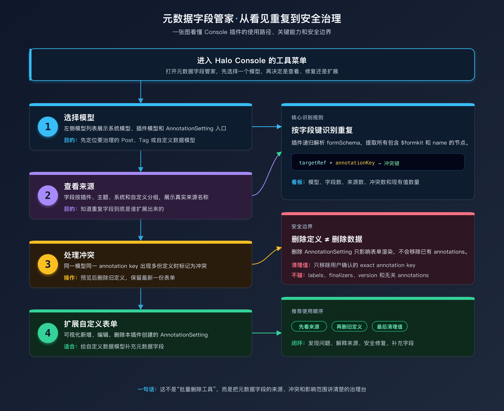

# 元数据字段管家

元数据字段管家是一个面向 Halo 管理员的 Console 插件，用来排查、归因和治理由主题或插件扩展出来的 `AnnotationSetting` 元数据表单字段。

当多个主题或插件为同一个模型注册了相同的 annotation key 时，Halo Console 可能会渲染出重复字段。这个插件会把“字段来自哪里、是否冲突、能否安全删除、现有数据里有没有值”展示清楚，帮助站点管理员安全地整理元数据表单。



<div style="display: flex; gap: 10px; width: 100%;">
    <div style="flex: 1;">
        
    </div>
    <div style="flex: 1;">
        
    </div>
</div>

## 功能亮点

- **模型总览**：左侧展示 Halo 当前注册的数据模型，区分系统模型、插件模型和特殊的 `AnnotationSetting` 治理入口。
- **来源归因**：识别元数据字段来自插件、主题、系统或自定义定义，并展示插件/主题名称。
- **冲突检测**：按 `targetRef + annotationKey` 检测重复字段，标记同一模型下冲突的表单项。
- **表单可视化**：基于 Halo 的 FormKit 元数据表单渲染方式，直观看到插件、主题和自定义字段。
- **重复定义清理**：支持预览并删除重复的 `AnnotationSetting` 定义，避免重复字段继续渲染。
- **自定义表单管理**：支持可视化新增、编辑和删除自定义元数据表单定义，适合给模型补充站点专属字段。
- **存量值查看与编辑**：查看模型数据中已有的 `metadata.annotations`，并在支持的模型上编辑元数据。
- **安全边界明确**：删除字段定义不会删除已有资源里的 `metadata.annotations` 值；清理值时只会移除用户指定的 exact annotation key。

## 适用场景

- 安装多个主题或插件后，同一个文章/页面/分类/标签元数据字段重复出现。
- 想知道某个元数据字段是哪个插件或主题扩展出来的。
- 想安全删除旧的、重复的 `AnnotationSetting` 定义。
- 想给 Halo 模型补充自定义元数据表单字段。
- 想检查已有内容中某个 annotation key 的使用情况。

## 使用方式

1. 安装并启用插件后，进入 Halo Console。
2. 在左侧菜单打开 **工具 / 元数据字段管家**。
3. 在左侧模型列表选择要查看的数据模型。
4. 右侧会展示模型基本信息、模型数据列表以及当前数据的元数据表单。
5. 如果进入 `AnnotationSetting` 治理入口，可以按 **全部 / 插件扩展 / 主题扩展 / 系统/自定义** 查看字段定义来源。
6. 对重复定义，先查看来源和冲突字段，再按需执行删除。
7. 对自定义定义，可以直接新增、编辑或删除；修改后重新加载即可生效。

## 安全说明

- 删除 `AnnotationSetting` 只是删除表单定义，不会删除模型数据中的 `metadata.annotations`。
- 清理存量值时只处理用户明确指定的 annotation key，不会修改 labels、finalizers、version 或无关 annotations。
- 插件不会修改 Halo Core，也不会直接修改主题包或其他插件包文件。
- 自定义表单定义由本插件创建，删除时只允许删除本插件标记的自定义 `AnnotationSetting`。

## 兼容环境

- Halo `>= 2.25.0`
- JDK 21
- Node.js 20
- pnpm

## 开发

```bash
# 启动 Halo 开发环境
./gradlew haloServer

# 前端开发
cd ui
pnpm install
pnpm dev
```

## 构建

```bash
./gradlew build
```

构建完成后，可以在 `build/libs` 目录找到插件 jar 文件。

## 交流群

欢迎加入 QQ 交流群，反馈问题、交流 Halo 插件和主题开发经验。


## 许可证

[GPL-3.0](./LICENSE) © webjing
